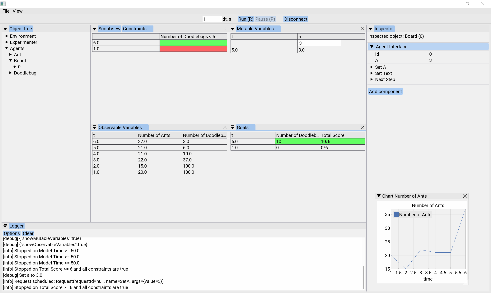

## Usage
1. запустить модель
2. gui/src/main/kotlin/main.kt - точка входа
3. ~~File -> Load configuration~~ Environment -> Configuration -> Model Configuration: Load (gui/src/main/resources/configuration.kts)
4. Experimenter -> Task: Load (gui/src/main/resources/experiment.kts)
5. port=4444 -> Connect

